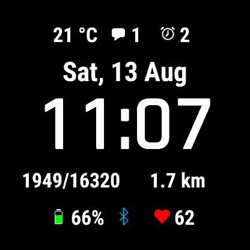

# Watch Face

## What's this?

A name-less, option-less Garmin Watch Face I made for personal use, and to learn
a bit more about the Connect IQ SDK and the underlying Monkey C language.

## Installation

Build via the Monkey C VSCode extension and copy the resulting `.prg` file into
the apps directory on the watch.

## Configuration

There is none, everything is hardcoded the way I like it :^)

For debugging the manual layout drawing code (indicator icons and labels) you
can set `WatchFaceView::_drawBoundingBoxes` to `true`.
